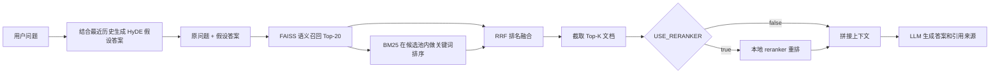

# Advanced RAG Optimization

本项目基于 `Langchain-Chatchat 0.2.x` 二次开发，重点不再是原版 Chatchat 的“本地大模型一键部署”，而是围绕知识库问答场景做 RAG 检索链路优化、OpenAI-compatible API 接入、轻量化启动和自动化评测。

当前版本默认走在线或网关形式的大模型 API，适合接入 OpenAI、One API、New API、阿里云百炼、硅基流动等兼容 OpenAI 协议的服务；同时保留 Chatchat 原有的 FastAPI、Streamlit WebUI、知识库管理、FAISS 向量库和本地模型扩展能力。

## 主要改动

- 默认 LLM 改为 `openai-api`，通过环境变量配置 `OPENAI_API_KEY`、`OPENAI_API_BASE`、`OPENAI_API_MODEL`。
- Embedding 支持 OpenAI-compatible `/embeddings` 接口，内置 `text-embedding-ada-002`、`text-embedding-3-small`、`text-embedding-3-large`、`text-embedding-v4` 等模型名。
- 新增 `-i/--lite` 启动模式，API 模式下不再强制启动本地 `model_worker`，降低本机显存和模型路径依赖。
- 知识库问答加入上下文感知 HyDE：结合最近对话生成假设性回答，再拼接原问题增强语义检索。
- 检索链路改为 FAISS 向量召回 + BM25 关键词召回 + RRF 融合，兼顾语义匹配和精确术语匹配。
- Reranker 默认关闭，可通过 `USE_RERANKER=true` 开启本地重排模型。
- 中文递归切分器增强了 Markdown 代码块和 LaTeX 块级公式保护，避免重要结构被切碎。
- 内置 `JAVA_GUIDE` 知识库与 `evaluation_dataset.jsonl`，配套 `auto_evaluator.py` 做 LLM-as-a-Judge 多维评测。
- 增加 Windows 兼容用的 `pwd.py` shim，降低部分依赖在 Windows 环境下导入失败的概率。
- 增加 `requirements_local_api_constraints.txt`，用于固定旧版 Chatchat 依赖栈在新版 pip 索引上的解析结果。

## RAG 流程



核心代码在 [server/chat/knowledge_base_chat.py](server/chat/knowledge_base_chat.py)：

- `reciprocal_rank_fusion()`：融合向量检索和 BM25 检索排名。
- `hyde_prompt`：结合最近 3 条历史对话生成查询扩展内容。
- `search_docs(... top_k=20)`：先扩大候选池，再由 BM25/RRF 进行二次排序。

## 目录说明

```text
.
├── startup.py                              # 服务启动入口，支持 -a -i Lite 模式
├── auto_evaluator.py                       # RAG 自动评测脚本
├── evaluation_dataset.jsonl                # JavaGuide 问答评测集
├── requirements_local_api_constraints.txt  # 本地 API 模式依赖约束
├── configs/
│   ├── model_config.py                     # LLM、Embedding、Reranker 配置
│   ├── kb_config.py                        # 知识库、切分、向量库配置
│   └── prompt_config.py                    # 对话和知识库问答 Prompt
├── server/
│   ├── chat/knowledge_base_chat.py         # HyDE + FAISS + BM25 + RRF 主链路
│   ├── knowledge_base/kb_cache/base.py     # OpenAI-compatible Embedding 封装
│   ├── knowledge_base/kb_cache/faiss_cache.py
│   └── reranker/reranker.py
├── text_splitter/chinese_recursive_text_splitter.py
├── webui.py
└── knowledge_base/
    ├── JAVA_GUIDE/                         # JavaGuide 测试知识库
    └── samples/                            # 原版示例知识库
```

## 环境要求

- Python 3.10 或 3.11 推荐。
- Windows / Linux 均可运行；本仓库当前配置对 Windows 本地 API 模式更友好。
- 默认 API 模式不需要本地大模型权重。
- 使用本地 reranker 或本地 LLM 时，需要自行准备模型路径和对应硬件资源。

## 安装

在项目根目录执行：

```powershell
python -m venv .venv
.\.venv\Scripts\Activate.ps1
python -m pip install -U pip

pip install -c requirements_local_api_constraints.txt -r requirements.txt
pip install jieba rank_bm25
```

如果你只想拆分安装，也可以按原 Chatchat 的方式安装：

```powershell
pip install -c requirements_local_api_constraints.txt -r requirements_api.txt
pip install -c requirements_local_api_constraints.txt -r requirements_webui.txt
```

## 配置大模型 API

### OpenAI 示例

```powershell
$env:OPENAI_API_KEY="你的 API Key"
$env:OPENAI_API_BASE="https://api.openai.com/v1"
$env:OPENAI_API_MODEL="gpt-4o-mini"
$env:LLM_MODELS="openai-api"
$env:EMBEDDING_MODEL="text-embedding-3-small"
$env:USE_RERANKER="false"
$env:OPENAI_PROXY=""
```

### 阿里云百炼兼容模式示例

```powershell
$env:OPENAI_API_KEY="你的阿里云百炼 API Key"
$env:OPENAI_API_BASE="https://dashscope.aliyuncs.com/compatible-mode/v1"
$env:OPENAI_API_MODEL="qwen-plus"
$env:LLM_MODELS="openai-api"
$env:EMBEDDING_MODEL="text-embedding-v4"
$env:USE_RERANKER="false"
$env:OPENAI_PROXY=""
```

`text-embedding-v4` 默认按 1024 维创建 FAISS 索引。如你的网关返回其他维度，可以显式指定：

```powershell
$env:OPENAI_EMBEDDING_DIMENSIONS="1024"
# 或
$env:DASHSCOPE_EMBEDDING_DIMENSIONS="1024"
```

## 初始化知识库

切换 Embedding 模型后，必须重建向量库，否则可能出现 FAISS 维度不一致的问题。

```powershell
python init_database.py --recreate-vs
```

本仓库内置了两个主要知识库：

- `samples`：原 Chatchat 示例知识库。
- `JAVA_GUIDE`：用于 RAG 优化和自动评测的 JavaGuide 文档知识库。

WebUI 中可以在“知识库管理”页面上传、更新、重建知识库文件。

## 启动

推荐使用本地 API Lite 模式：

```powershell
python startup.py -a -i
```

启动成功后访问：

- WebUI: http://127.0.0.1:6006
- API Docs: http://127.0.0.1:7861/docs
- Chatchat API: http://127.0.0.1:7861

常用接口：

- `POST /chat/chat`：普通 LLM 对话。
- `POST /chat/knowledge_base_chat`：知识库问答，已接入 HyDE + 混合检索 + RRF。
- `POST /knowledge_base/*`：知识库管理相关接口。

如果你确实要使用本地模型 worker，可以关闭 Lite 模式并在 `configs/model_config.py` 中配置本地模型路径：

```powershell
python startup.py -a
```

## Reranker

默认关闭 reranker，避免 API 模式下额外下载或加载本地模型：

```powershell
$env:USE_RERANKER="false"
```

如需启用，需要先准备 `sentence_transformers` 依赖和本地 reranker 模型路径，例如 `bge-reranker-large`：

```powershell
$env:USE_RERANKER="true"
$env:RERANKER_MODEL="bge-reranker-large"
```

模型路径在 [configs/model_config.py](configs/model_config.py) 的 `MODEL_PATH["reranker"]` 中配置。

## 自动评测

先启动服务，再运行：

```powershell
$env:RAG_MODEL_NAME="openai-api"
$env:RAG_KB_NAME="JAVA_GUIDE"
python auto_evaluator.py
```

评测脚本会读取 [evaluation_dataset.jsonl](evaluation_dataset.jsonl)，逐条调用 `/chat/knowledge_base_chat` 获取 RAG 答案，然后用 `/chat/chat` 做 LLM-as-a-Judge 打分。

当前评测维度：

- `Faithfulness`：事实忠实度，观察是否出现幻觉或编造。
- `Answer Relevance`：回答相关性，观察是否答非所问。
- `Correctness`：核心准确率，观察结论是否与标准答案一致。

评测集覆盖了精确匹配、逻辑推理、模糊问法和多跳问题等类型。

## 常见问题

### 1. 启动后提示没有 API Key

确认当前终端已经设置：

```powershell
$env:OPENAI_API_KEY="..."
```

PowerShell 环境变量只在当前窗口有效，换窗口后需要重新设置。

### 2. FAISS 报维度不一致

通常是因为更换了 Embedding 模型，但旧向量库还在。重建即可：

```powershell
python init_database.py --recreate-vs
```

### 3. `rank_bm25` 或 `jieba` 缺失

混合检索依赖这两个包：

```powershell
pip install jieba rank_bm25
```

### 4. API 网关不是 OpenAI 官方地址

只要网关兼容 OpenAI Chat Completions 和 Embeddings 协议，修改这几个变量即可：

```powershell
$env:OPENAI_API_BASE="你的兼容网关 /v1 地址"
$env:OPENAI_API_MODEL="你的聊天模型名"
$env:EMBEDDING_MODEL="你的 embedding 模型名"
```

### 5. 开启 reranker 后报模型或依赖错误

`USE_RERANKER=true` 会加载本地 CrossEncoder 模型。请确认：

- 已安装 `sentence_transformers`。
- `configs/model_config.py` 中的 reranker 路径存在。
- 当前设备有足够内存或显存。

## 与原版 Chatchat 的关系

本项目仍然保留并复用 Langchain-Chatchat 的主体架构，包括 FastAPI 服务、Streamlit WebUI、知识库管理、向量库封装、Prompt 模板和部分模型 worker 机制。

本仓库的主要目标是演示和验证一条更适合知识库问答质量优化的 RAG 管线：

```text
上下文感知查询扩展 -> 语义召回 -> 关键词召回 -> RRF 融合 -> 可选重排 -> 自动评测
```

原项目遵循 Apache License 2.0，本项目在其基础上继续保留相同许可证。详见 [LICENSE](LICENSE)。
